<!-- ═══════════════════════════════════════════════════════ -->
<!--  N E V E R M O R E _ O S  —  github.com/DanielCarvalhoOut  -->
<!-- ═══════════════════════════════════════════════════════ -->

<!-- ── séance: atividade real ── -->

  

<i>Deep into that darkness peering... — "Quoth the Raven, «Nevermore.»"</i> 🐦‍⬛

 

